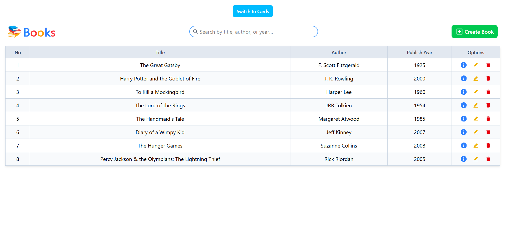
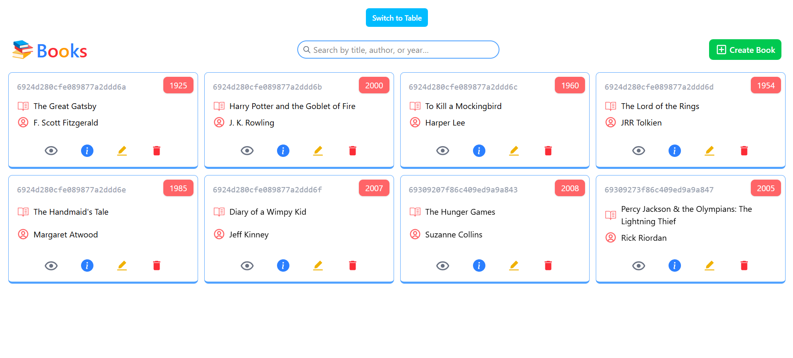
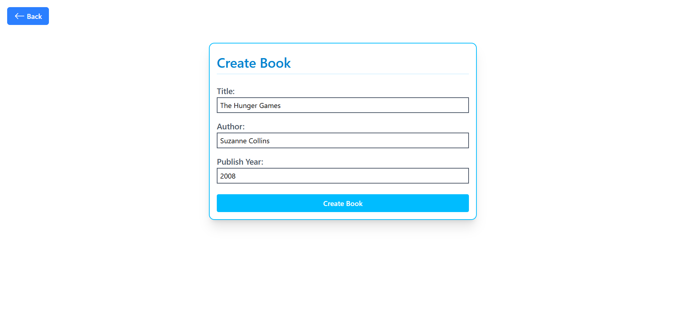
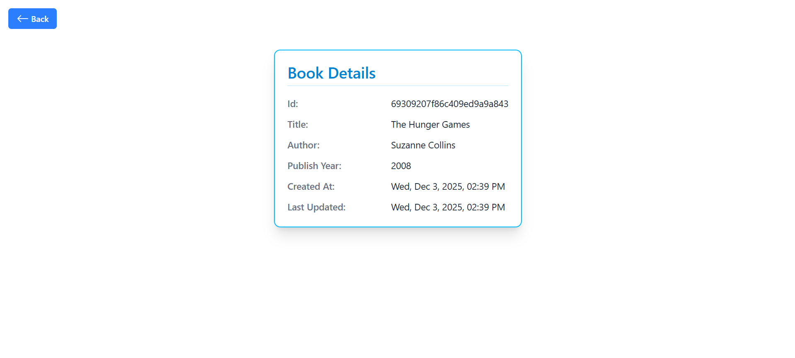
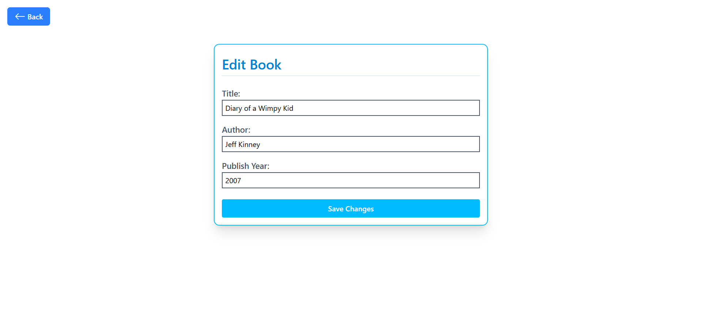
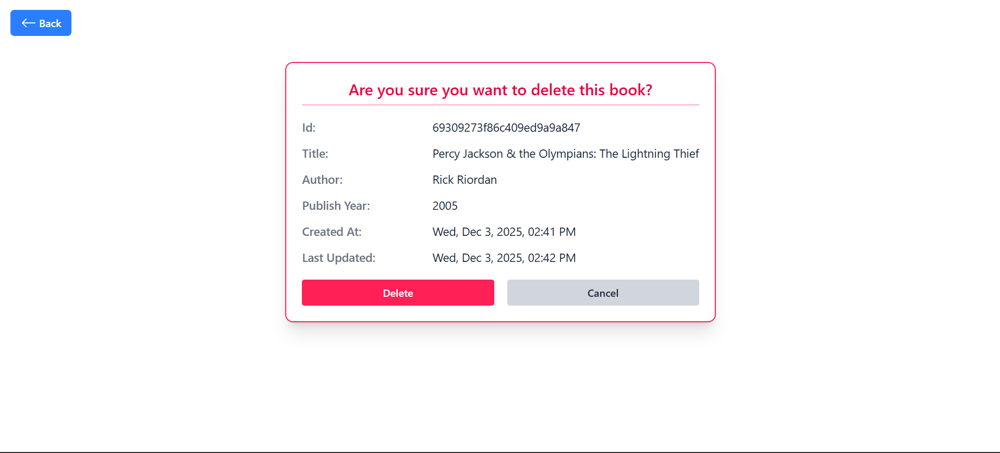

# 📚 MERN Bookstore

A **Full Stack MERN (MongoDB, Express, React, Node.js)** application to manage books. Users can create, read, update, and delete books, and search through them in a table or card layout.

## 🚀 Features

- **View all books** in a table or card layout
- **Search books** by title, author, or year
- **Add new books** with title, author, and publish year
- **Edit existing books**
- **Delete books**
- **Book details view** with created and updated timestamps
- Responsive UI with **Tailwind CSS**
- Real-time feedback with **React Toastify**
- Modal preview for book cards

## ⚙️ Tech Stack

- **Frontend:** React, React Router, Tailwind CSS, React Icons, Axios, React Toastify  
- **Backend:** Node.js, Express.js, MongoDB, Mongoose  
- **Other:** CORS, dotenv, Nodemon (for development)

## 📸 Screenshots
**Homepage (table layout):**


**Homepage (card layout):**


**Create Book:**


**Show Book:**


**Edit Book:**


**Delete Book:**


## 📦 Installation & Setup

1. **Clone the repository**
   ```bash
   git clone https://github.com/AryanPatel1918/mern-bookstore.git
   cd mern-bookstore
   ```

2. **Navigate to the backend folder**
    ```bash
    cd backend
    ```

3. **Install dependencies**
    ```bash
    npm install
    ```

4. **Create a .env file**
    ```bash
    PORT=5000
    MONGO_URI=your_mongodb_connection_string
    ```

5. **Start the backend server**
    ```bash
    npm run dev
    ```

6. **Navigate to the frontend folder**
    ```bash
    cd frontend
    ```

7. **Install dependencies**
    ```bash
    npm install
    ```

8. **Start the frontend server**
    ```bash
    npm run dev
    ```

3. **Open the app in the browser:** http://localhost:5173/
